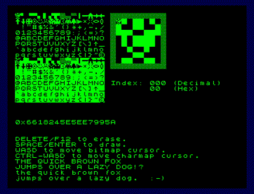
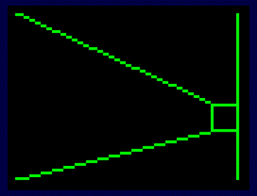
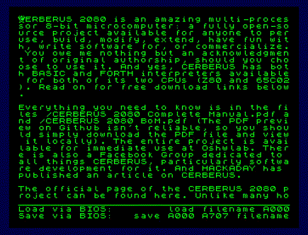
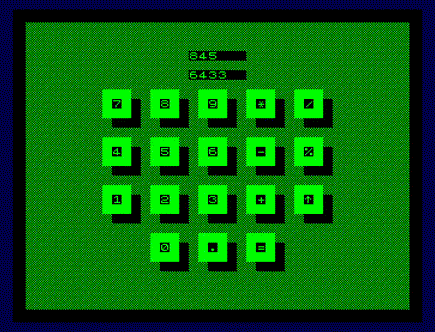

# cerberus2080-c-demos

Demo programs for the [The Byte Attic's CERBERUS 2080™](https://github.com/TheByteAttic/CERBERUS2080) computer written in C using Z88DK.

|||
|:-:|:-:|
|||

## Setup

Z88DK must be installed to compile the C programs in this repository. [See the Z88DK README for details.](https://github.com/z88dk/z88dk#installation) I use the Snap package local installation approach on a Ubuntu machine.

Run `git clone https://github.com/TomAwezome/cerberus2080-c-demos && cd cerberus2080-c-demos` to download the demo programs.

## Compiling

The programs are written targetting the Z80 processor, memory map, and standard BIOS of the CERBERUS 2080™. To compile program source code, the following command can be used:

`zcc +z80 -vn -O3 -startup=0 -clib=new -I.. main.c -o output -create-app`

In the above command, `main.c` is the C source code of the program, and `output` is the desired name of the resulting program binary. That command will generate a file `output.bin`, which is the final program binary. If Z88DK was installed using the Snap package, then it may be necessary replace `zcc` with `z88dk.zcc` due to Snap package command name prefixing. To see verbose output, replace `-vn` with `-v`. If a program requires floating point support, add the `-lm` flag.

The final program binary can be loaded into the CERBERUS 2080™ at the standard $202 address.

## Notes

Programs are tested using [paulscottrobson's CERBERUS 2080™ emulator](https://github.com/paulscottrobson/cerberus-2080).

For details on configuring Z88DK,  [see Z88DK's NewLib Embedded Z80 guide](https://github.com/z88dk/z88dk/wiki/NewLib--Platform--Embedded).

